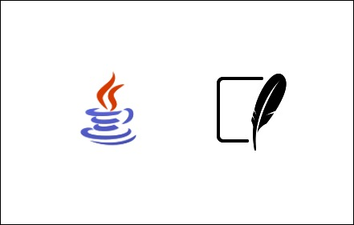
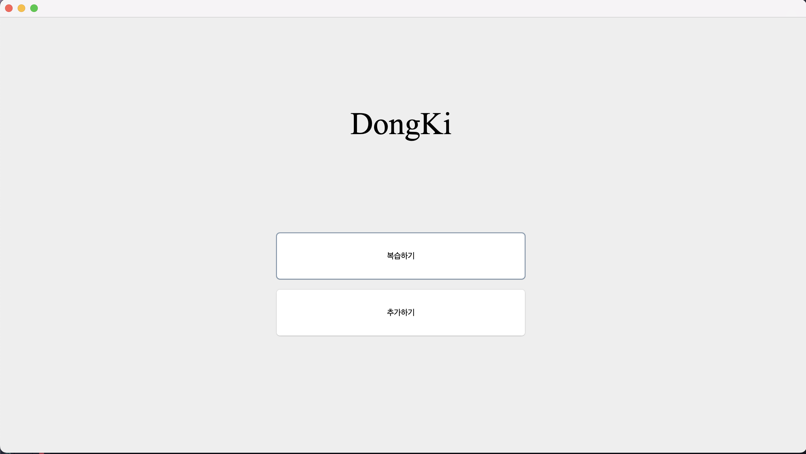
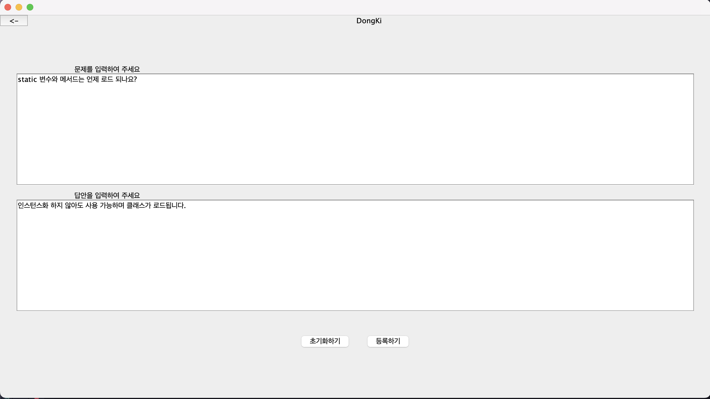
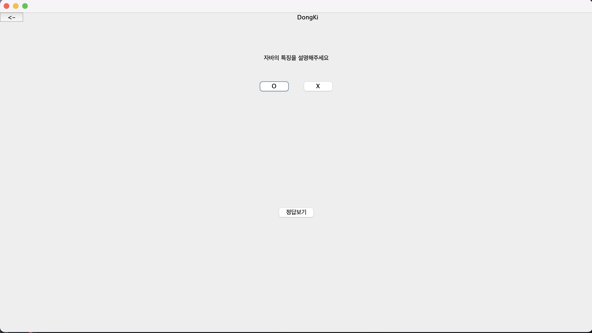
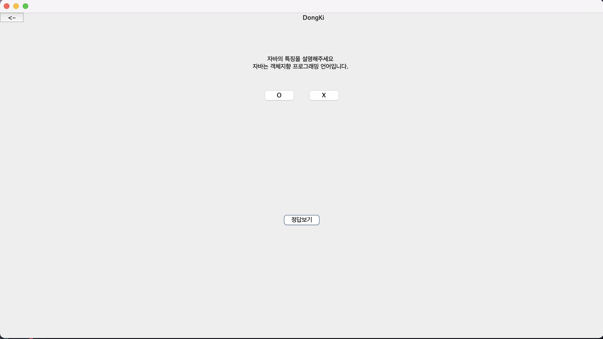
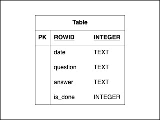

## ✨ DongKi (개요)

복습을 도와주는 Anki와 유사한 기능을 가진 프로그램을 제작하는 것을 목표로 합니다.
특히 Java와 Swing 라이브러리만을 사용하여 구현하는 것을 주요 목표로 설정하였습니다.
이를 통해 복습 학습의 효율을 높이는 동시에, Java 언어와 GUI 프로그래밍에 대한 이해를 심화하고자 합니다.

## 📅 개발기간
- 2025-4-27 ~ 2025-4-27 (1day)

## 👨‍👩‍👧‍👦  팀 규모
- 개인 프로젝트

## 🛠️ 사용 기술



### Java
  - 클래스 분리와 객체지향 프로그래밍(OOP) 원칙에 초점을 맞추어 체계적인 소프트웨어 구조를 설계하고자 했습니다.
  - Java 17 버전을 사용하여 개발을 진행하였습니다.
### SQLite
  - SQLite는 경량화된 데이터베이스로 별도의 서버 구축 없이 파일 단위로 관리할 수 있어 배포 및 유지보수가 매우 용이합니다.
  - 작은 규모의 데이터 저장 및 관리를 위해 서버 없이 독립적으로 사용할 수 있어서 사용하였습니다.
  - 최종적으로 프로그램을 Windows용 `.exe` 파일로 패키징하여 배포할 예정이기 때문에 로컬에 데이터가 저장되는 구조가 필요했습니다.

## 🖥️ 최종 화면
<details>
<summary>접기/펼치기</summary>
<div markdown="1">

>- 메인 화면
   
>- 질문 추가하기
   
>- 복습하기
   
   

</div>
</details>

## 📎 추가자료 (DB, 트러블슈팅)
<details>
<summary>접기/펼치기</summary>
<div markdown="1">

### DB


```java
var sql = "CREATE TABLE IF NOT EXISTS warehouses ("
	+ " date text NOT NULL,"
	+ " question text,"
	+ " answer text,"
	+ "is_done INTEGER"
	+ ");";
```

### 🚨 트러블슈팅
### 🛑 문제 상황 1 : DB에 데이터가 있는데도 조회 결과가 0건이 나오는 문제
- `warehouses` 테이블에 `date` 컬럼 기준으로 데이터가 존재함에도 불구하고,  
  `SELECT COUNT(*)` 쿼리를 실행했을 때 항상 0건이 반환됨.
- 로직은 여러 날짜(d1, d2, d3, d4, d5)를 순회하면서 해당 날짜별 데이터 개수를 합산하는 형태였음.
##### 🔍 원인 분석
1. **PreparedStatement 사용법 오류**
    - `executeQuery(sql)`처럼 SQL을 다시 전달하면서 실행했음.
    - PreparedStatement는 미리 쿼리를 컴파일해두기 때문에, `executeQuery()`를 **빈칸으로 호출**해야 한다.

2. **ResultSet 처리 오류**
    - `ResultSet`에서 데이터를 읽을 때, `rs.next()`를 호출하지 않고 바로 값을 꺼내려고 했음.
    - JDBC에서는 `rs.next()`를 호출해야 커서가 첫 번째 row로 이동하고, 이후 값을 읽을 수 있다.

3. **SQL alias 설정 누락**
    - `SELECT COUNT(*)` 결과를 읽을 때 `"DISTINCT COUNT(*)"`라는 잘못된 컬럼명을 사용했음.
    - SQL에서 alias(별칭)를 사용해 결과 컬럼 이름을 명시하고, 해당 이름으로 값을 꺼내야 한다.
#### 🛠 해결 방법
1. **PreparedStatement 올바르게 사용**
2. **ResultSet에서 커서 이동**
3. **SQL 컬럼 alias 지정**

#### 🧑‍💻 BEFORE 코드
```java
var sql = "SELECT DISTINCT COUNT(*) FROM warehouses WHERE date = ?";

try (var conn = DriverManager.getConnection(CreateTable.DB_URL);
	var stmt = conn.prepareStatement(sql)) {

	for (String checkDate : checkDates) {
	    stmt.setString(1, checkDate);
	    var rs = stmt.executeQuery(sql);
	    cnt += rs.getInt("DISTINCT COUNT(*)");
	}
} catch (SQLException e) {
	System.err.println(e.getMessage());
}
```
#### 🧑‍💻 AFTER 코드
```java
String sql = "SELECT COUNT(*) AS cnt FROM warehouses WHERE date = ?";

try (var conn = DriverManager.getConnection(CreateTable.DB_URL);
	var stmt = conn.prepareStatement(sql)) {

	for (String checkDate : checkDates) {
	    stmt.setString(1, checkDate);
	    try (var rs = stmt.executeQuery()) {
	        if (rs.next()) {
	        cnt += rs.getInt("cnt");
	        }
	    }
	}
} catch (SQLException e) {
	System.err.println(e.getMessage());
}
```

### 🛑 문제 상황 2 : ROWID 가져오는 문제
- warehouses 테이블에서 date 컬럼을 조건으로 조회할 때, 분명히 데이터가 존재함에도 불구하고, ROWID를 제대로 가져오지 못하고 question 내용도 출력되지 않는 문제가 발생하였다.
- ResultSet에서 rs.next() 호출 없이 바로 데이터를 꺼내려고 시도하고 있었다.
##### 🔍 원인 분석
1. ResultSet 커서 이동 누락
   - JDBC에서 쿼리 결과를 읽기 위해서는 반드시 ResultSet 객체의 next() 메서드를 호출해 커서를 데이터 행으로 이동시켜야 한다. rs.next()를 호출하지 않으면 커서는 데이터 시작 지점(초기 상태)에 머물러 있으며, 데이터를 정상적으로 읽을 수 없다.
2. 여러 행 처리 미흡
   - 한 날짜에 여러 개의 질문(question)이 있을 수 있는데, 기존 코드는 ResultSet에서 반복문(while) 없이 한 번만 값을 읽으려 했다. 결과적으로, 여러 행을 처리하지 못하고 첫 번째 데이터도 정상적으로 읽지 못하는 문제가 생겼다.
#### 🛠 해결 방법
1. **ResultSet에서 while(rs.next()) 반복문을 통해 모든 결과 행을 순회하도록 수정**
2. **각 행에 대해 id(ROWID)와 question을 정상적으로 읽어오도록 코드를 개선**

#### 🧑‍💻 BEFORE 코드
```java
for (String checkDate : checkDates) {  
    stmt.setString(1, checkDate);  
    var rs = stmt.executeQuery();  
    ids.add(rs.getInt("id"));  
    System.out.println(rs.getString("question"));  
}
```
#### 🧑‍💻 AFTER 코드
```java
for (String checkDate : checkDates) {  
    stmt.setString(1, checkDate);  
    var rs = stmt.executeQuery();  
    while (rs.next()) {  
        ids.add(rs.getInt("id"));  
        System.out.println(rs.getString("question"));  
    }  
}
```
</div>
</details>

## 🧠 회고
<details>
<summary>접기/펼치기</summary>
<div markdown="1">

### 🎯 프로젝트 목표
- 인프런의 '널널한 개발자의 자바' 강의를 Part4까지 수강한 후 단순히 강의 수강에 그치지 않고 직접 프로젝트를 진행하여 학습 내용을 체득하는 것을 목표로 하였다.

### 💡 잘한 점
- 강의만 듣는 것에 그치지 않고 하루 동안 프로젝트를 스스로 기획하고 개발해보면서 이론을 실제 코드로 체득할 수 있었다.

- 개발 과정에서는 한글 문서나 블로그에 의존하지 않고 공식 레퍼런스 문서를 우선적으로 참고하였다. 레퍼런스 문서에서 해결할 수 없는 경우에만 StackOverflow를 활용하여 문제를 해결하는 방식으로 문제 해결 능력을 키웠다.

### 🔥 아쉬운 점
- 클래스를 작성할 때 각 클래스의 목적과 역할을 명확하게 분리하는 데 어려움을 겪었다. 특히 어떤 기준으로 클래스를 나눌지 판단하는 부분에서 많은 고민이 있었다.
  
- 코드 중복이 여러 곳에 발생했지만 이번 프로젝트 내에서는 이를 완전히 정리하지 못했다. 이후 추가 개선이 필요한 부분이다.

- SQL 관련 학습을 진행한지 시간이 지나면서 기본적인 쿼리 작성이나 최적화에 대한 감이 많이 떨어져 있음을 느꼈다.

### 🛠️ 개선 방향
- 다음 프로젝트에서는 클래스 분리 기준을 명확히 세우고, 개발 초기에 설계(다이어그램 작성 등)부터 시작하는 습관을 들이고자 한다.

- 중복 코드를 줄이기 위해 헬퍼 메소드나 공통 클래스를 적극적으로 도입하고, 리팩토링 시간을 별도로 확보할 계획이다.

- SQL 최적화와 데이터베이스 설계에 대해 다시 한 번 학습을 진행하고, 보다 성능을 고려한 쿼리 작성 연습을 병행할 예정이다.

### 📝 느낀 점
- 이번 프로젝트를 통해 강의에서 배운 내용을 직접 구현해보면서 지식이 단단해지는 경험을 할 수 있었다.

- 앞으로는 **어떻게 설계하고, 어떻게 더 나은 구조를 만들 수 있을까**를 고민하면서 개발하는 습관을 더욱 키워야겠다고 느꼈다.

</div>
</details>